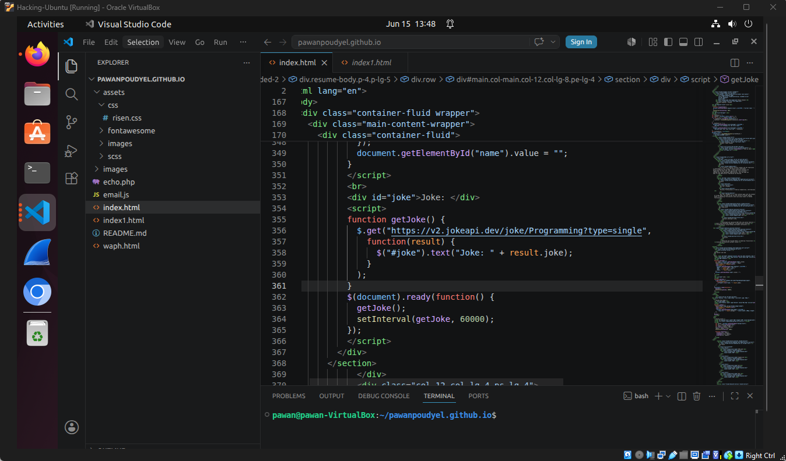
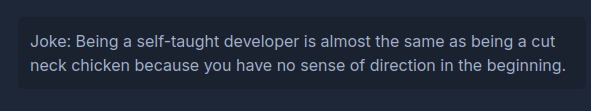
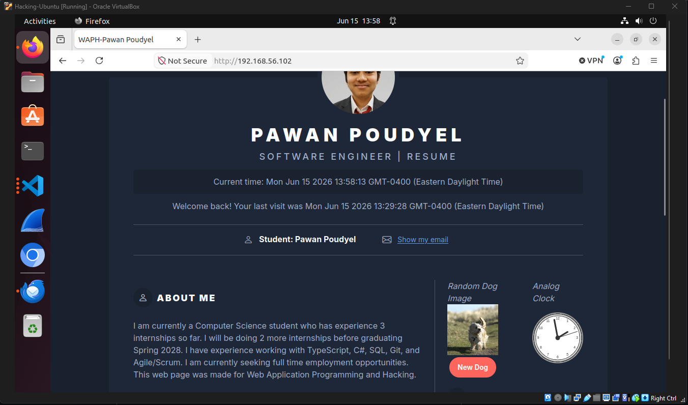
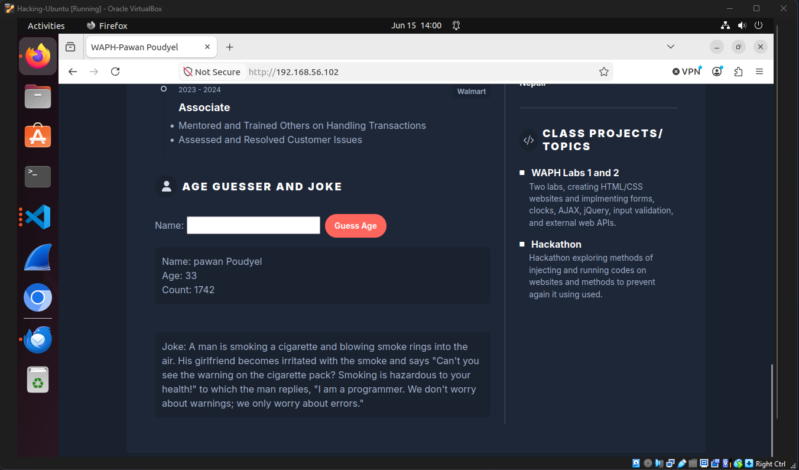
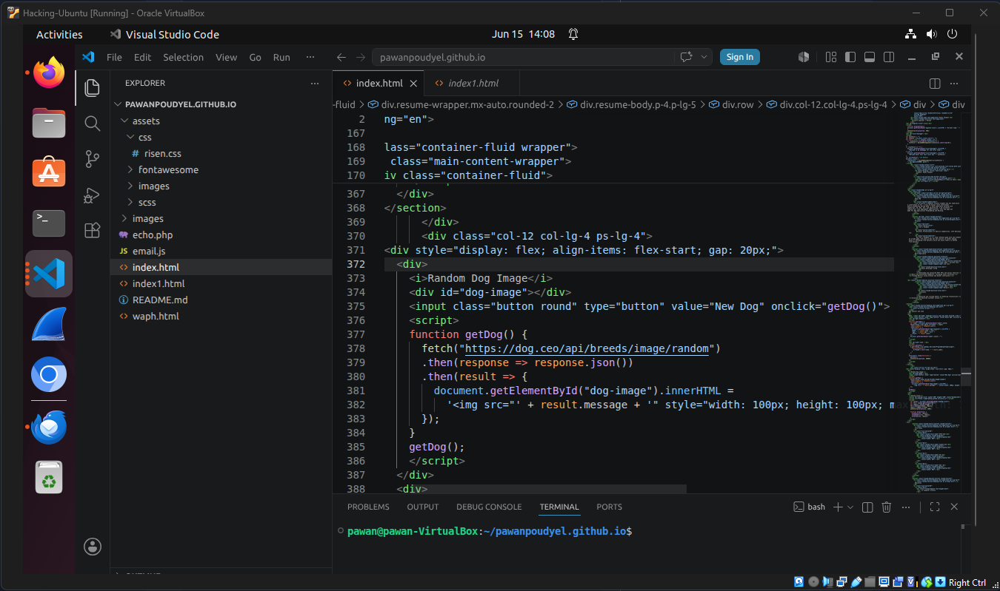
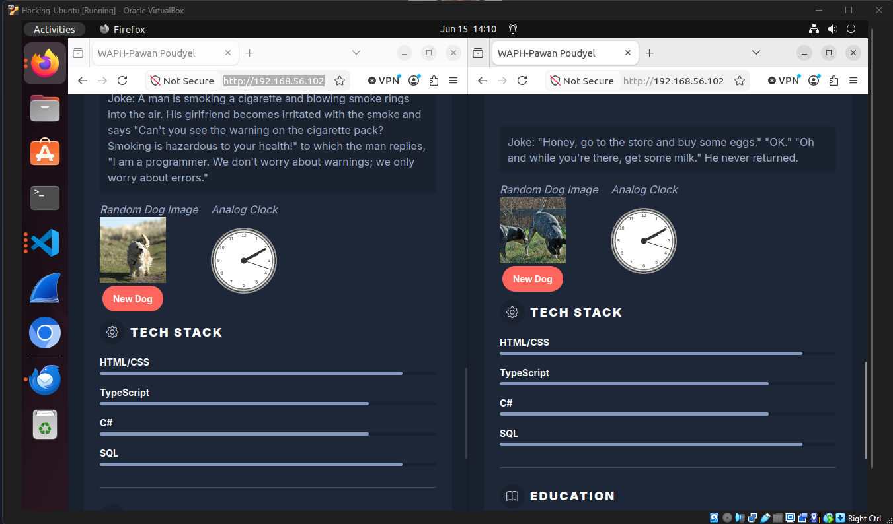
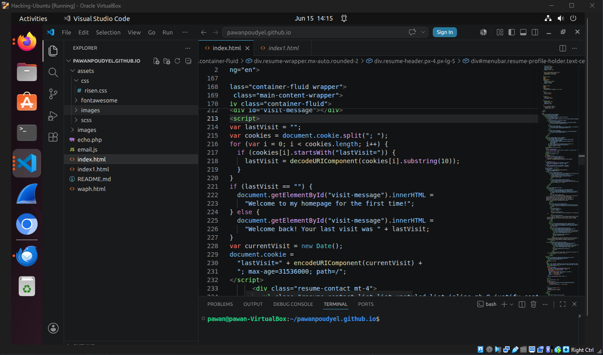
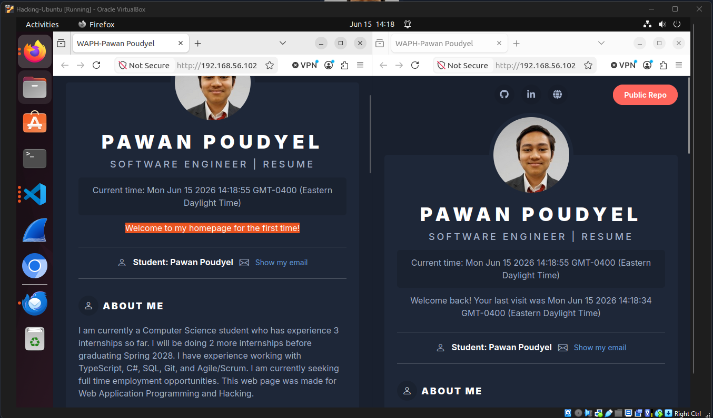

# WAPH-Web Application Programming and Hacking

## Instructor: Dr. Phu Phung

## Student

**Name**: Pawan Poudyel

**Email**: [mailto:poudyepn@mail.uc.edu](poudyepn@mail.uc.edu)

**Short-bio**: Pawan Poudyel is intrested in software development and has co-oped at LCS for 3 rotations.

## Repository Information

Respository's URL: [https://github.com/pawanpoudyel/waph-pawanpoudyel.git](https://github.com/pawanpoudyel/waph-pawanpoudyel.git)

Public Respository's URL: [https://pawanpoudyel.github.io/](https://pawanpoudyel.github.io/)

This is a private repository for Pawan Poudyel to store all code from the course. The organization of this repository is as follows.

### Labs 

[Hands-on exercises in lectures](labs) 

  - [Lab 0](/labs/lab0): Lab0's Report 
  - [Lab 1](/labs/lab1): Lab1's Report 
  - [Lab 2](/labs/lab2): Lab2's Report 

### Hackations

Hands-on hacking exercises

### Individual Projects

- [Personal Page](/index.html): Personal Project 1

### Team Project

# Personal Project 1 - Professional Profile Website on github.io cloud service   

[Template used for website](https://themes.3rdwavemedia.com/bootstrap-templates/resume/risen-free-bootstrap-5-dark-mode-resume-cv-template-for-developers/).  

## Overview and Requirements 

For individual project 1, we will further build on what we learned in lab2 and create a
personal page for employers. We will use a JavaScript script framework to make a professional
website and include elements from lab 2 and add new public API integrations.

[https://github.com/pawanpoudyel/pawanpoudyel.github.io](https://github.com/pawanpoudyel/pawanpoudyel.github.io).

### Task 1: Technical Page Requirements 1

The first requirement is for us to use jQuery and a JavaScript framework/library for our personal website.

####  a. jQuery

Here is an example of me using jQuery for calling an API that gives you a random code

  

Here is a joke it got about being a self-taught developer

  
####  b. Code from Lab 2

For this section I had to include parts from lab 2 like my
digital clock, analog clock, show/hide email, and another
functionality from lab 2.  

Here you can see the analog clock, digital clock, and show
email button which has been copy/pasted from lab 2.

Image here shows the Age Guesser which is the extra
functionality I added from lab 2  

### Task 2: Technical Page Requirements 2

For technical requirements 2 I need had to add 2 public web APIs,
one of them had to be the jokeAPI and for the other one I decided
to use the dog API that gets a random picture of a dog.

####  a. Two Public Web APIs

Here is the jokeAPI from lab 2 that gets a new joke every 60 seconds  

  

Here is a joke it got about on my website 

  

This is the public dog web API I decided to use which get a
random picture of a dog each time you load into the website  

  

Here you can see the 2 different pictures it got when I loaded
the page from 2 tabs. And here you can also see how the page gets
resized to fit the smaller window from using the framework.

  

### Task 3: Technical Page Requirements 3  

For the last requirement I needed to use cookies to remember a user
a display a message on my webpage depending on how many times the page
has already been visited.  

####  a. JavaScript to Remember User 

Here is my JavaScript that I used to remember the user and display
a different message each time.

  

The Image below shows what message a first time user sees and
also what a returning user would see.

### Outcomes

From this personal project we put everything we have learned in the course so far to create
a personal website that employers can look at to learn more about us and potentially get a
job offer. Creating the website required using HTML/CSS, JavaScript(jQuery and aJax),
public WebAPIs, and a CSS framework.

## Report and deliverables

As in previous labs, you need to create a sub-folder `labs/lab2` with a `README.md` file to write a report in Markdown format and generate the report to PDF using the `pandoc` application. All of the code from this lab must also be stored in this folder and included in the report if required. **Please note that demo screenshots must include your virtual machine name or your name with proper captions and be visible, e.g., not too blurry or with much blank space, for grading**. Your report should follow the template provided in Lecture 2 ([https://github.com/waph-phung/waph/blob/main/README-template.md](https://github.com/waph-phung/waph/blob/main/README-template.md)) which should include the course name and instructor, your name and email together with your headshot (150x150 pixels), and sub-sections of the lab's overview, and each task and sub-task.

Similar to Lab 1, in the lab's overview sub-section, you need to write an overview of the lab and the outcomes you learned from this lab. Also, include a direct clickable link to the lab folder on GitHub.com so that it can be viewed when grading, for example,  [https://github.com/waph-phung/waph-phungph/tree/main/labs/lab2](https://github.com/waph-phung/waph-phungph/tree/main/labs/lab2). You will earn 0 points for this sub-section; however, you will **lose 3 pts if missing**.

For each sub-task, write a brief summary of how you completed it, and include appropriate code and demo screenshot(s) accordingly. 

## Submission

Use the `pandoc` tool to generate the PDF report for submission from the `README.md` file, and make sure that the report and contents are rendered properly.

**Note**: If you face the issue that figures are not rendered in preferred positions, use option `-f markdown-implicit_figures -t pdf` to disable the default `implicit_figures` option in `pandoc`

The PDF file should be named `your-username-waph-lab2.pdf`, e.g., `poudyepn-waph-lab2.pdf`, and uploaded to Canvas to submit by the deadline. 

### Notes about the submission policy from the syllabus:

> Each assignment/submission has a deadline, which must be submitted on Canvas -> Assignments to be graded, i.e., submissions via email or other channels will NOT be graded. You need to submit your work before the deadlines so that you can gain the expected outcomes and feedback in a timely manner. To avoid last-minute issues, you need to start working on each submission when it is released, ideally during hands-on activities while watching lecture videos. By doing this, if you face any issues, you should be able to seek support from the instructor and the TA to complete your work on time. Waiting until a later time or close to the deadlines to start any assignment will prevent you from being successful in this class; therefore, you need to plan your time carefully. To encourage you to do and submit your work earlier, there will be a 0.05% bonus every hour before the original deadline (up to 3% maximum bonus for each submission, i.e., you will get a 3% bonus if you submit 60 hours or earlier before the deadline).   

 

> If you missed an original deadline, although it is strongly NOT encouraged, you would be allowed to make late submissions until the end Week 11. Every 24 hours late will be deducted 1% of the grade of the submission. You will get at least 77% credit for late submissions. However, you are strongly recommended to AVOID these late submissions. They will not only give you a low grade in this course but also prevent you from learning the concepts introduced in that assignment and the next related topics/assignments. Always talk to the instructor if you fall behind in any work/concepts/lectures. Experience in the past shows that missing or late assignment submissions will result in a very low grade in this class. 