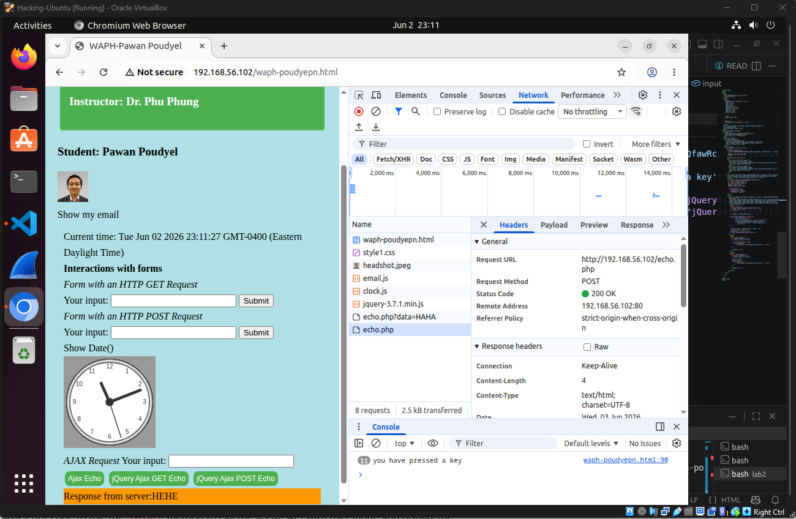
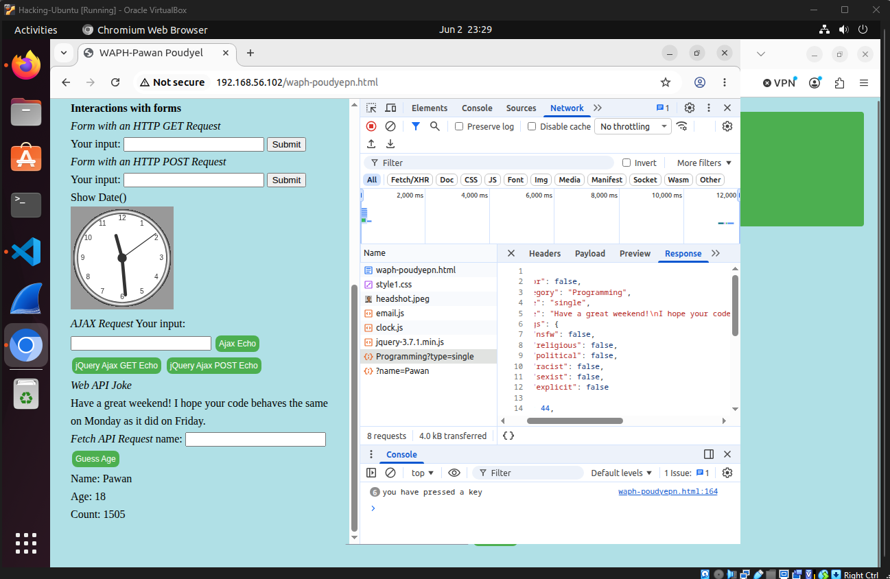
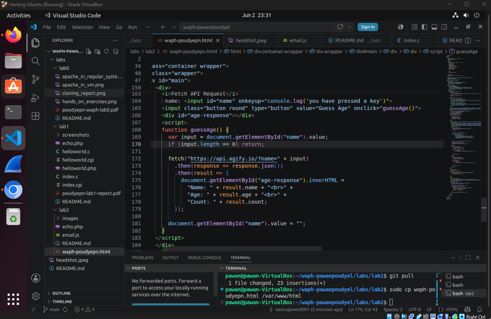
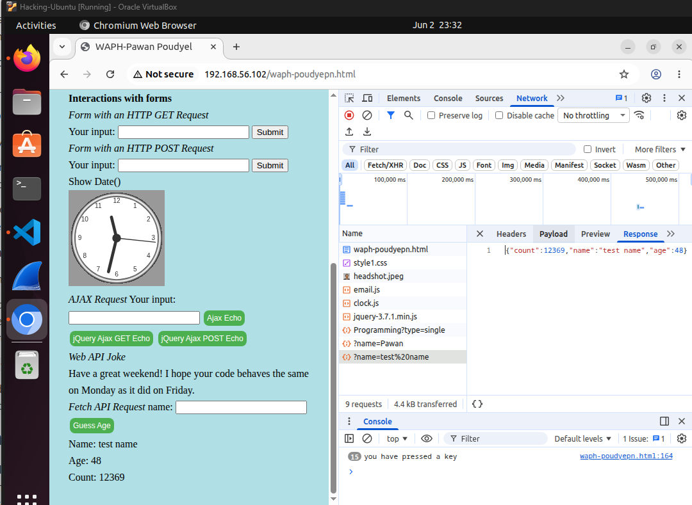

# WAPH-Web Application Programming and Hacking

## Instructor: Dr. Phu Phung

## Student

**Name**: Pawan Poudyel

**Email**: [mailto:poudyepn@mail.uc.edu](poudyepn@mail.uc.edu)

**Short-bio**: Pawan Poudyel is intrested in software development and has co-oped at LCS for 3 rotations.

## Repository Information

Respository's URL: [https://github.com/pawanpoudyel/waph-pawanpoudyel.git](https://github.com/pawanpoudyel/waph-pawanpoudyel.git)

This is a private repository for Pawan Poudyel to store all code from the course. The organization of this repository is as follows.

### Labs 

[Hands-on exercises in lectures](labs) 

  - [Lab 0](/labs/lab0): Lab0's Report 
  - [Lab 1](/labs/lab1): Lab1's Report 
  - [Lab 2](/labs/lab2): Lab2's Report 

### Hackations

Hands-on hacking exercises

### Individual Projects

### Team Project

# Lab 2 - Front-end Web Development 

## Overview and Requirements 

In lab 2 we are going to do some basic front end web development. We will first make a basic html website with forms and javascript.
Using javascript we will run some basic javascript functions and get the for example the time and date. Then in the second half of
the lab we will use ajax to run GET and POST API requests asynchronously. We will also format our html website using CSS.
Finally we will integrate a Web API using ajax to display a random joke.

[https://github.com/pawanpoudyel/waph-pawanpoudyel/tree/main/labs/lab2](https://github.com/pawanpoudyel/waph-pawanpoudyel/tree/main/labs/lab2).

### Task 1: Basic HTML with forms, and JavaScript 

I created a file called waph-poudyepn.html and wrote basic html code to make a website that displays my information, has forms,
a button to show my email, and the date and time. For the forms the php file from lab1 was reused.

####  a. HTML (5 pts) 

NOTE: Almost all of the screenshots were taken after completing the lab

This is what the html website looks like wiht my info and headshot

  
####  b. Simple JavaScript (15 pts)

This is the code I wrote to display the clock and forms for my website

Image shows the clock and email on the website

### Task 2: Ajax, CSS, jQuery, and Web API integration

In task 2, I used an ajax javascript script in html to get and print out when the user preses down on a key and I also
used the echo.php from lab 1 to send an ajax get request and display the result. Next I used CSS to format my html website
and used the jQuery library to send GET requests, and did some web API integration by print out random jokes.

####  a. Ajax (7.5 pts)

Here is the code I used to detect and log when a user presses a key

An example of a GET request being sent

#### b. CSS (7.5 pts)

This is what the entire website looks like after I formatted it

Some of the CSS code I used

Here is the structre of my HTML code and the classes I gave to the divs

####  c. jQuery (5 pts)

HAHA was sent as a GET request and you can see it on the network tab and you can see that the POST request for HEHE returned 200 OK

 

#### d. Web API integration (10 pts)

This is my website generating a random joke and the response I got from jokeapi.dev with the joke

I used the fetch method to get the age of the user and get the count as well

Here is the 200 ok reponse I got with the data it returned in the network tab

### Outcomes

From this lab I learned more about building front-end apps using HTML, CSS, Javascript (with jQuery and aJax), and Web APIs. I built a basic website that displayed my
information and had forms with a clock. I made GET and POST requests by reusing the .php file from lab 1.  But overall I mostly felt like this was review since I
have done similar things during my co-op but we did not use jQuery and aJax.

## Report and deliverables

As in previous labs, you need to create a sub-folder `labs/lab2` with a `README.md` file to write a report in Markdown format and generate the report to PDF using the `pandoc` application. All of the code from this lab must also be stored in this folder and included in the report if required. **Please note that demo screenshots must include your virtual machine name or your name with proper captions and be visible, e.g., not too blurry or with much blank space, for grading**. Your report should follow the template provided in Lecture 2 ([https://github.com/waph-phung/waph/blob/main/README-template.md](https://github.com/waph-phung/waph/blob/main/README-template.md)) which should include the course name and instructor, your name and email together with your headshot (150x150 pixels), and sub-sections of the lab's overview, and each task and sub-task.

Similar to Lab 1, in the lab's overview sub-section, you need to write an overview of the lab and the outcomes you learned from this lab. Also, include a direct clickable link to the lab folder on GitHub.com so that it can be viewed when grading, for example,  [https://github.com/waph-phung/waph-phungph/tree/main/labs/lab2](https://github.com/waph-phung/waph-phungph/tree/main/labs/lab2). You will earn 0 points for this sub-section; however, you will **lose 3 pts if missing**.

For each sub-task, write a brief summary of how you completed it, and include appropriate code and demo screenshot(s) accordingly. 

## Submission

Use the `pandoc` tool to generate the PDF report for submission from the `README.md` file, and make sure that the report and contents are rendered properly.

**Note**: If you face the issue that figures are not rendered in preferred positions, use option `-f markdown-implicit_figures -t pdf` to disable the default `implicit_figures` option in `pandoc`

The PDF file should be named `your-username-waph-lab2.pdf`, e.g., `poudyepn-waph-lab2.pdf`, and uploaded to Canvas to submit by the deadline. 

### Notes about the submission policy from the syllabus:

> Each assignment/submission has a deadline, which must be submitted on Canvas -> Assignments to be graded, i.e., submissions via email or other channels will NOT be graded. You need to submit your work before the deadlines so that you can gain the expected outcomes and feedback in a timely manner. To avoid last-minute issues, you need to start working on each submission when it is released, ideally during hands-on activities while watching lecture videos. By doing this, if you face any issues, you should be able to seek support from the instructor and the TA to complete your work on time. Waiting until a later time or close to the deadlines to start any assignment will prevent you from being successful in this class; therefore, you need to plan your time carefully. To encourage you to do and submit your work earlier, there will be a 0.05% bonus every hour before the original deadline (up to 3% maximum bonus for each submission, i.e., you will get a 3% bonus if you submit 60 hours or earlier before the deadline).   

 

> If you missed an original deadline, although it is strongly NOT encouraged, you would be allowed to make late submissions until the end Week 11. Every 24 hours late will be deducted 1% of the grade of the submission. You will get at least 77% credit for late submissions. However, you are strongly recommended to AVOID these late submissions. They will not only give you a low grade in this course but also prevent you from learning the concepts introduced in that assignment and the next related topics/assignments. Always talk to the instructor if you fall behind in any work/concepts/lectures. Experience in the past shows that missing or late assignment submissions will result in a very low grade in this class. 